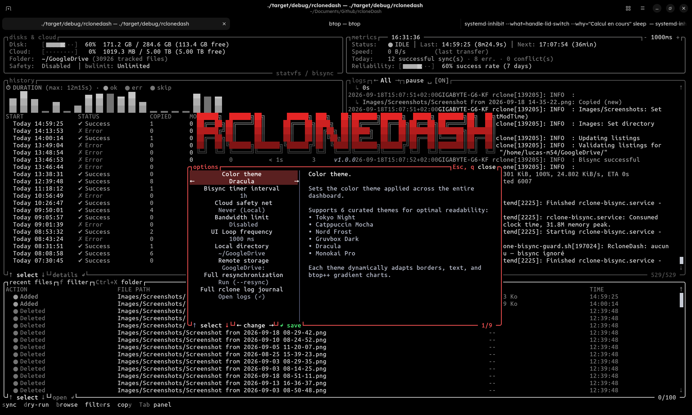
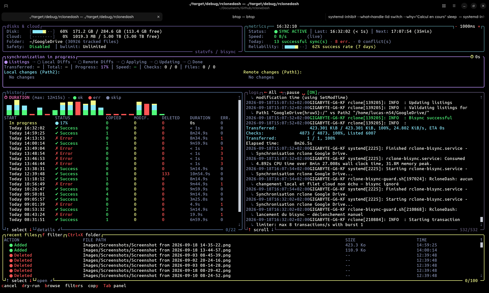
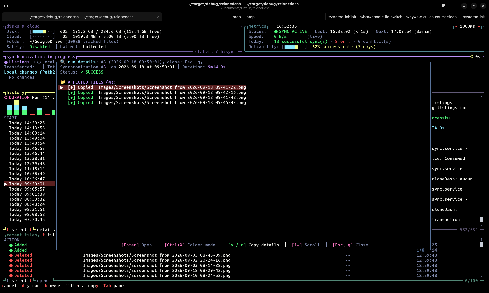
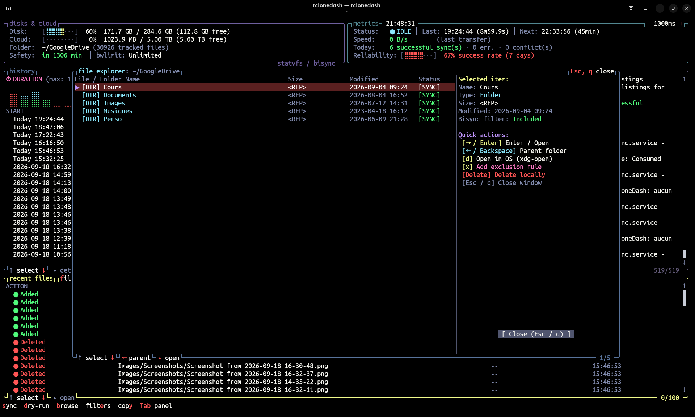

# RcloneDash (Rust TUI & Dashboard)

**RcloneDash** est une interface terminal interactive (TUI) ultra-rapide, élégante et autonome développée en **Rust** (inspirée de `btop++` et `lazygit`), conçue pour surveiller et piloter vos synchronisations bidirectionnelles (`rclone bisync`) en temps réel.

Le projet conserve également son interface Web historique (située dans le dossier `web/`).

---

## ⚡ RcloneDash TUI (Version Rust)

Construit avec **[Ratatui](https://ratatui.rs/)**, **[Crossterm](https://github.com/crossterm-rs/crossterm)** et **[Tokio](https://tokio.rs/)**, RcloneDash TUI se compile en un **binaire unique autonome (< 3 Mo)** sans dépendance externe, avec une consommation mémoire infime (< 10 Mo de RAM).

---

## 📸 Screenshots & Interface Showcase

<!-- Place your screenshots in assets/screenshots/ with the corresponding filenames -->

| Main Dashboard | Interactive Options & Settings |
| :---: | :---: |
|  |  |

| Live Synchronization & Stepper | History Details & Error/Diff Inspection |
| :---: | :---: |
|  |  |

| Built-in File Explorer | Exclusion Filters Editor |
| :---: | :---: |
|  |  |

---

### 🌟 Fonctionnalités TUI

- **Tableau de bord tout-en-un centralisé (Vue Unique Dashboard)** :
  - **En-tête dynamique moderne** : statuts du service `rclone-bisync` (actif/en attente/échec), heure et durée de dernière sync, compte à rebours du timer systemd, et boutons interactifs pills (`[ ⟳ Sync ]`, `[ 📁 Files ]`, `[ ⊘ Filters ]`, `[ ⚙ Options ]`, `[ ✕ Quit ]`).
  - **Barre des 7 cartes KPI clés** :
    1. *Stockage Cloud* (ex: Google Drive).
    2. *Disque Local* (calcul `statvfs` en direct : Go utilisés, Go libres et totaux).
    3. *Fichiers suivis* (compte réel des fichiers surveillés).
    4. *Syncs aujourd'hui* (compteur de réussites et erreurs de la journée).
    5. *Débit en direct* (vitesse de transfert instantanée rclone).
    6. *Conflits aujourd'hui* (détection automatique des erreurs dans les logs).
    7. *Fiabilité 7 jours* (taux de réussite sur la semaine glissante).
  - **Panneau Milieu Gauche - Historique & Mini-Graphe** :
    - Mini-graphique en barres Unicode de durée et de statut (` ▂▃▄▅▆▇█`).
    - Tableau interactif des synchronisations passées avec sélection et détails des fichiers copiés, modifiés, supprimés et durées.
  - **Panneau Milieu Droit - Journal de bord en direct (Live Logs)** :
    - Streaming fluide des logs depuis `journalctl` avec coloration syntaxique intelligente.
    - Défilement automatique intelligent ou pause (`Space` / molette).
  - **Panneau Inférieur - Fichiers récemment synchronisés** :
    - Badges colorés de statut (`● Ajouté`, `● Modifié`, `● Supprimé`), chemins relatifs et horodatage.
- **Menu Principal style btop++ (Overlay Modal)** :
  - Accessible via `Échap` ou `m` (ou clic sur le bouton `[m]enu`).
  - Grand bandeau ASCII art, version et 3 gros boutons arrondis (`[o] Options`, `[h] Aide`, `[q] Quitter`).
- **Menu Paramètres (Overlay Modal)** :
  - Sélection parmi 6 thèmes modernes (*Tokyo Night, Catppuccin Mocha, Nord, Gruvbox, Dracula, Monokai Pro*).
  - Réglage de l'intervalle bisync, du filet de sécurité cloud (avec option `Jamais (Local)` pour désactiver le filet cloud), de la limite `bwlimit`, et de la fréquence de rafraîchissement.
  - Sauvegarde instantanée dans `dash-config.json`.
- **Simulation Dry-Run (Overlay Modal)** :
  - Accessible via `d` ou le bouton `[ 🛡 Simuler ]`.
  - Lance un `rclone bisync --dry-run` en tâche de fond pour prévisualiser les transferts sans modifier aucun fichier.
- **Explorateur de fichiers & Historique interactif avec support xdg-open** :
  - Parcourez les fichiers synchronisés ou l'historique complet des runs.
  - `Entrée` ou clic pour ouvrir le fichier dans l'application par défaut.
  - `Ctrl+Entrée`, `d` ou `Ctrl+Clic` pour ouvrir le dossier contenant dans le gestionnaire de fichiers système.
- **Widget de fréquence de rafraîchissement style btop++** :
  - Affichage `[- 250ms +]` en haut à droite avec boutons interactifs cliquables et raccourcis clavier (`-` pour accélérer, `+` pour ralentir).
- **Annulation dynamique des synchronisations** :
  - Le bouton du bandeau devient dynamiquement `[ ⏹ Arrêter ]` en rouge lorsqu'une synchronisation est active.
  - Raccourci `c` pour annuler immédiatement via `systemctl --user stop rclone-bisync.service`.
- **Calibration pixel-perfect de la souris** :
  - Hitboxes dynamiques recalculées au pixel près pour chaque bouton, ligne de tableau, zone de logs et élément modale.

---

### ⌨️ Raccourcis Clavier & Souris

| Raccourci | Action |
| :--- | :--- |
| `Clic gauche` | Cliquer sur un bouton, un run d'historique, un fichier ou une option |
| `Ctrl + Clic` | Ouvrir le dossier parent du fichier dans l'explorateur système |
| `Molette haut/bas` | Défilement fluide des logs et des listes |
| `Échap` / `m` | Ouvrir le **Menu Principal** style `btop++` (ou fermer la modale active) |
| `o` | Ouvrir les **Paramètres** (ou ouvrir le fichier sélectionné) |
| `d` | Lancer une **Simulation Dry-Run** (ou ouvrir le dossier du fichier sélectionné) |
| `s` / Clic `[ ⟳ Sync ]` | **Forcer une synchronisation** immédiate |
| `c` / Clic `[ ⏹ Arrêter ]` | **Interrompre** la synchronisation en cours |
| `r` | Lancer une **Resynchronisation complète** (`--resync`) avec confirmation |
| `f` / Clic `[ 📁 Fichiers ]` | Ouvrir l'**Explorateur de fichiers** local |
| `e` / Clic `[ ⊘ Filtres ]` | Ouvrir la **Gestion des règles d'exclusion** |
| `t` | **Changer de thème visuel** à la volée (cycle parmi 6 thèmes) |
| `-` / `+` | **Accélérer** (`-`) ou **ralentir** (`+`) la fréquence de rafraîchissement en ms |
| `Espace` | Mettre en pause / Reprendre le défilement auto des logs |
| `Entrée` | Ouvrir les détails du run ou ouvrir le fichier sélectionné |
| `Ctrl + Entrée` | Ouvrir le **dossier contenant** le fichier sélectionné |
| `Tab` / `Shift+Tab` | Changer de panneau actif (Historique / Logs / Fichiers récents) |
| `▲/▼` ou `j/k` | Naviguer dans les lignes du tableau ou des listes |
| `q` | **Quitter silencieusement** l'application |

---

### 🚀 Installation et Démarrage

#### Méthode 1 : Paquet Debian / Ubuntu (.deb) — Le plus simple
Téléchargez le fichier `.deb` depuis la page des [Releases GitHub](https://github.com/lucas-martinati/rcloneDash/releases/latest) et installez-le en une seule commande avec `apt` :

```bash
sudo apt install ./rclonedash_*_amd64.deb
```

> **Astuce — Téléchargement et installation directe :**
> ```bash
> wget https://github.com/lucas-martinati/rcloneDash/releases/latest/download/rclonedash_1.0.0-1_amd64.deb
> sudo apt install ./rclonedash_1.0.0-1_amd64.deb
> ```

Une fois installé :
- **Lancer l'interface TUI :**
  ```bash
  rclonedash
  ```
- **Configurer la synchronisation automatique systemd & filtres** *(optionnel, exécuter dans votre session utilisateur sans `sudo`)* :
  ```bash
  rclonedash-setup
  ```

Pour désinstaller à tout moment :
```bash
sudo apt remove rclonedash
```

#### Méthode 2 : Installation automatique sans root (Archive release ou Git)
Que vous utilisiez une archive `.tar.gz` issue des **Releases GitHub** ou le dépôt cloné, lancez simplement le script d'installation utilisateur :

```bash
./install.sh
```

Ce script effectue automatiquement et sans privilèges root (`sudo` interdit) :
1. L'installation du binaire `rclonedash` dans votre `~/.local/bin/`
2. La configuration du script de garde intelligent dans `~/.local/share/RcloneDash/`
3. La mise en place des filtres d'exclusion et de la configuration dans `~/.config/rclone/`
4. L'enregistrement et l'activation du timer systemd utilisateur (`rclone-bisync.timer`)

Pour désinstaller proprement à tout moment :
```bash
./uninstall.sh
```

#### Méthode 3 : Lancement en mode développement
```bash
cargo run
```

#### Méthode 4 : Compilation manuelle
```bash
cargo build --release
./target/release/rclonedash
```

---

### 🌐 Version Web Historique

La version originale avec tableau de bord web HTML/CSS/JS et backend Python (`rclone-monitor.py`) est conservée dans le dossier `web/`.
Pour la lancer manuellement :

```bash
python3 web/rclone-monitor.py
```
Puis accédez à [http://localhost:8765](http://localhost:8765).
